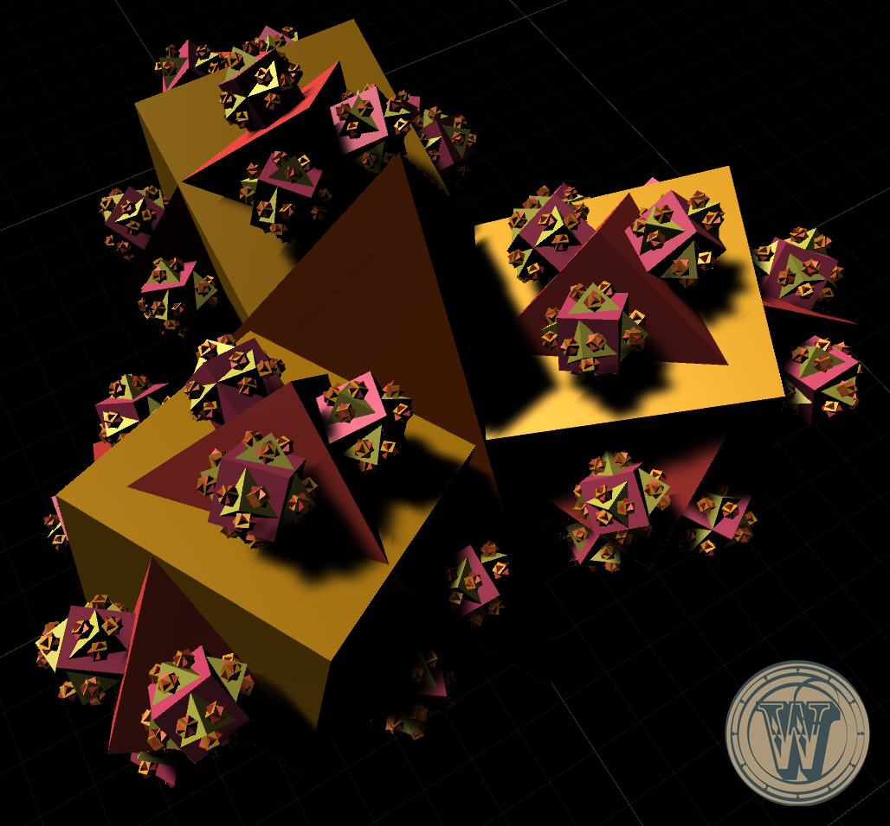

# Prototype Fractal Magic

### Tech

- Unity 5.5.1
- Oculus Utilities 1.11.0
- Oculus Avatar sdk 1.10.1 (for Oculus Touch)

### Design

Fractal Magic Prototype is a Virtual Reality experience in Oculus Rift that aims to illustrate the concept of function chaining. In this prototype, the player will create custom fractal magic by combining and layering spells that create shapes. The more complex the spells, the more intricate and beautiful the resulting fractal.

In terms of computer science, the player will generate fractal shapes by chaining different shape functions together. There will be two shapes: tetrahedron and cube. Player will be able to place the shapes into the custom function, and then use that function as a “magic” to generate the fractal shape he wants.

Our team believes people can get better understanding of function chaining once they can visualize the fractal growing process. The fractal consists of different layers; if the player passes in the first layer cube and the second layer, tetrahedron, the fractal will grow with first layer as cube and second layer as tetrahedron.

### Todos

 - Visual the calling process
 - Color the instanced command
 - ...

### Credit

This project is a joint effort of members within Team Wonderland:
- Miram Harries (Producer)
- Beiqi(Nick) Guan
- Guanqiao(Joe) Wang
- Jiawen Liang
- Luqing(Luna) Zhang
- Zhi(Zach) Ai
